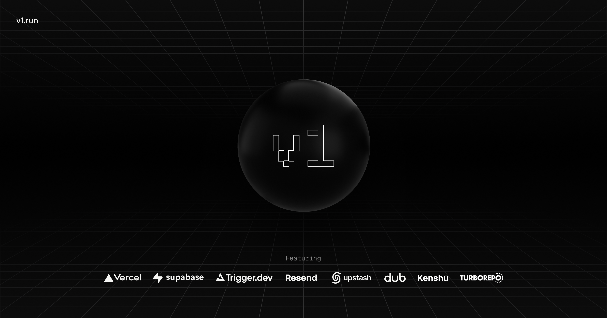

<p align="center">
	<h1 align="center"><b>Create v1</b></h1>
<p align="center">
    An open-source starter kit based on <a href="https://midday.ai">Midday</a>.
    <br />
    <br />
    <a href="https://v1.run"><strong>Website</strong></a> · 
    <a href="https://github.com/midday-ai/v1/issues"><strong>Issues</strong></a> · 
    <a href="#whats-included"><strong>What's included</strong></a> ·
    <a href="#prerequisites"><strong>Prerequisites</strong></a> ·
    <a href="#getting-started"><strong>Getting Started</strong></a> ·
    <a href="#how-to-use"><strong>How to use</strong></a>
  </p>
</p>

Everything you need to build a production ready SaaS, it's a opinionated stack based on learnings from building Midday using the latest Next.js framework, it's a monorepo with a focus on code reuse and best practices that will grow with your business.

## What's included

[Next.js](https://nextjs.org/) - Framework<br>
[Turborepo](https://turbo.build) - Build system<br>
[Biome](https://biomejs.dev) - Linter, formatter<br>
[TailwindCSS](https://tailwindcss.com/) - Styling<br>
[Shadcn](https://ui.shadcn.com/) - UI components<br>
[TypeScript](https://www.typescriptlang.org/) - Type safety<br>
[Supabase](https://supabase.com/) - Authentication, database, storage<br>
[Upstash](https://upstash.com/) - Cache and rate limiting<br>
[React Email](https://react.email/) - Email templates<br>
[Resend](https://resend.com/) - Email delivery<br>
[i18n](https://next-international.vercel.app/) - Internationalization<br>
[Sentry](https://sentry.io/) - Error handling/monitoring<br>
[Dub](https://dub.sh/) - Sharable links<br>
[Trigger.dev](https://trigger.dev/) - Background jobs<br>
[OpenPanel](https://openpanel.dev/) - Analytics<br>
[Polar](https://polar.sh) - Billing (coming soon)<br>
[react-safe-action](https://next-safe-action.dev) - Validated Server Actions<br>
[nuqs](https://nuqs.47ng.com/) - Type-safe search params state manager<br>
[next-themes](https://next-themes-example.vercel.app/) - Theme manager<br>

## Directory Structure

```
.
├── apps                         # App workspace
│    ├── api                     # Supabase (API, Auth, Storage, Realtime, Edge Functions)
│    ├── app                     # App - your product
│    ├── web                     # Marketing site
│    └── ...
├── packages                     # Shared packages between apps
│    ├── analytics               # OpenPanel analytics
│    ├── email                   # React email library
│    ├── jobs                    # Trigger.dev background jobs
│    ├── kv                      # Upstash rate-limited key-value storage
│    ├── logger                  # Logger library
│    ├── supabase                # Supabase - Queries, Mutations, Clients
│    └── ui                      # Shared UI components (Shadcn)
├── tooling                      # are the shared configuration that are used by the apps and packages
│    └── typescript              # Shared TypeScript configuration
├── .cursorrules                 # Cursor rules specific to this project
├── biome.json                   # Biome configuration
├── turbo.json                   # Turbo configuration
├── LICENSE
└── README.md
```

## Prerequisites

Bun<br>
Docker<br>
Upstash<br>
Dub<br>
Trigger.dev<br>
Resend<br>
Supabase<br>
Sentry<br>
OpenPanel<br>

## Getting Started

Clone this repo locally with the following command:

```bash
bunx degit midday-ai/v1 v1
```

1. Install dependencies using bun:

```sh
bun i
```

2. Copy `.env.example` to `.env` and update the variables.

```sh
# Copy .env.example to .env for each app
cp apps/api/.env.example apps/api/.env
cp apps/app/.env.example apps/app/.env
cp apps/web/.env.example apps/web/.env
```

4. Start the development server from either bun or turbo:

```ts
bun dev // starts everything in development mode (web, app, api, email)
bun dev:web // starts the web app in development mode
bun dev:app // starts the app in development mode
bun dev:api // starts the api in development mode
bun dev:email // starts the email app in development mode

// Database
bun migrate // run migrations
bun seed // run seed
```

## How to use
This boilerplate is inspired by our work on Midday, and it's designed to serve as a reference for real-world apps. Feel free to dive into the code and see how we've tackled various features. Whether you're looking to understand authentication flows, database interactions, or UI components, you'll find practical, battle-tested implementations throughout the codebase. It's not just a starting point; it's a learning resource that can help you build your own applications.

With this, you have a great starting point for your own project.

## Deploy to Vercel

Vercel deployment will guide you through creating a Supabase account and project.

[](https://vercel.com/new/clone?repository-url=https%3A%2F%2Fgithub.com%2Fmidday-ai%2Fv1&env=RESEND_API_KEY,UPSTASH_REDIS_REST_URL,UPSTASH_REDIS_REST_TOKEN,SENTRY_AUTH_TOKEN,NEXT_PUBLIC_SENTRY_DSN,SENTRY_ORG,SENTRY_PROJECT,DUB_API_KEY,NEXT_PUBLIC_OPENPANEL_CLIENT_ID,OPENPANEL_SECRET_KEY&project-name=create-v1&repository-name=create-v1&redirect-url=https%3A%2F%2Fv1.run&demo-title=Create%20v1&demo-description=An%20open-source%20starter%20kit%20based%20on%20Midday.&demo-url=https%3A%2F%2Fv1.run&demo-image=https%3A%2F%2Fv1.run%2Fopengraph-image.png&integration-ids=oac_VqOgBHqhEoFTPzGkPd7L0iH6)

## Recognition

<a href="https://news.ycombinator.com/item?id=41408929">
  
</a>

so hello and welcome back guys so in 
this video we are going to uh learn 
about how you can install a shed CN into 
your next GS project so if you don't 
know what is shed Cen so shed Cen is a 
library UI Library uh which allows uh 
which allow you to copy and paste uh 
like element means uh if you want to use 
any type of UI ele component you can 
simply uh use components which are 
created by another people okay 
is not only one UI Library there are 
much more so uh what you 
can there are lot of uh material UI is 
one of them 
okay this is one of 
them exterity UI is very uh good UI if 
you want to try out so there are a lot 
of of components which are extremely 
extremely uh what you can say animated 
or Okay so this kind of uh components 
you can try out okay so in this video we 
are going to use the shed CN UI inside 
our nextjs application so this is the vs 
code I have opened so now I'm going to 
open the terminal over 
here so let's create a nextjs 
application first of all 
npx 
create next app 
atate 
T shed is name of our application 
typescript yes yes L yes T CSS Source 
no so our uh next JS application will be 
ready so 
sh official 
documentation which is or go to 
installation and go to next 
GS okay so here you can find uh when 
means if you are having any type of 
package manager like npm pnpm y fun 
whatever it is so you can install Okay 
so first of all uh run this command into 
your terminal 
where the next GS application is build 
okay so our next GS application inside 
in this Shar CN folder so I'm am going 
to uh move into the Shar CN 
folder and paste the command and hit 
enter whatever you can uh choose this is 
only the style H prefer 
so I 
have 
initialized the shed CN into my next GS 
project let's try to add this button 
into our 
project so just simply copy this command 
and paste over uh in the terminal and 
hit enter only that's what you have to 
do if this kind of warning you uh see 
then choose the dash dash Legacy perer 
deps it will uh remove the warning of 
the uh what it is saying the deprecated 
versions of 
okay so what it has done it has firstly 
created a lib folder when we initialized 
this in this lip folder we are having a 
utils okay you don't have to touch it 
inside this component there is a UI 
folder created by the shed CN and inside 
this this UI folder you will be getting 
all over all your components which you 
will be using from this Shad CN UI so 
here it is the button component 
okay so let's go to the uh first of all 
page do TSX remove all this from here 
and simply try to use that that button 
over here so I will be using the button 
atate components SL ui/ 
button this is how you can include a 
button so let me start this 
application so this is the button we 
have to pass the child for this so let's 
say it a button 
so this is how you can create there are 
so many propes you can find it out on 
the Shar scene or if you are uh 
exploring then go to this by the command 
plus click or Control Plus click so you 
can see what it is saying it is it is 
having a propes the class name you can 
pass the variant the size the as child 
as child if uh you want to to pass 
another component as a child okay then 
uh you can do this 
one and what variant variant is type of 
let's say if I give it a variant of 
outline then it will be a button of 
outline type of 
outline 
variant outline okay so this is how 
outline will work 
so this is how if you let's say uh let's 
try 
another 
component let's say yeah this one chart 
one okay let's try 
to use this 
one so simply copy this 
command open a new terminal and just CD 
to Shad CN first of all and paste that 
command 
okay you can see the we are having a 
chart do 
TSX and we have to uh include this base 
layer into our globals do CSS so 
here uh yeah let's copy this one only 
and inside this 
and this one is for dark because shed C 
and sports dark and light both theme so 
that's 
why now let's include that chart 
first of all you have to uh let say this 
is the chart data let me copy that from 
here 
and after that what it is saying it is 
[Music] 
saying the chart config holds the 
configuration of the uh chart so let's 
uh copy this one 
also so the chart config will come from 
where from the chart okay so this is uh 
what we have to do 
now this is 
the uh this is the way from where you 
can uh say use this one so I'm going to 
copy this one all this thing from here 
here okay so we have to import all these 
things to chart container from chart 
container bar chart from bar chart bar 
from 
bar okay let's try to 
uh 
visit what it is 
saying let's try to make it 
uh use client component if yeah why I 
made this use client component because 
inside this next GS next JS is a full 
stack framework so this directive what 
it is saying it is saying this component 
should be rendered over the client and 
after that it will be expecting the 
client intervention or uh the touch like 
if we are having a button so button 
where would be the button will be 
accessible inside on the client side so 
this is how that's why I have made this 
is to a use client it is not a good 
practice to make a use uh client or 
client component the whole page TSX 
because uh by doing this you will be 
losing your ability or the power of the 
next DS okay so what you have to do you 
have to ideally uh push this code into a 
uh separate file and make that file a 
client component and directly use that 
okay so this is how you can use the shed 
CN into your project I hope you guys 
loved this video so thank you so much 
for watching this video I will see you 
in the next video bye-bye 
 - Generated with https://kome.ai